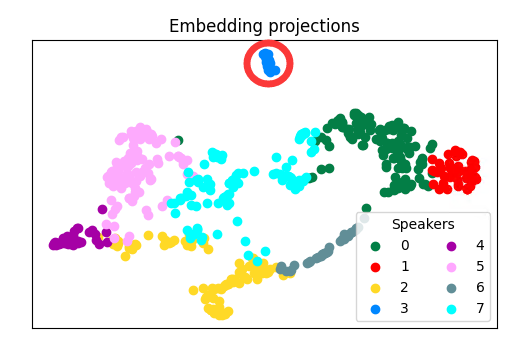

# ColorSplitter

[中文文档](README_CN.MD)

A command-line tool for separating vocal timbres

# Introduction

ColorSplitter is a command-line tool designed to classify the timbre styles of single-speaker data in the early stages of vocal data processing. **Please note**, this project is based on speaker identification technology, and it is currently uncertain whether the timbre changes in singing are completely related to the differences in voiceprints, just for fun :) The research in this field is still lacking, and this is just a start. Thanks to the community users:

# Environment Configuration

It works normally under `python3.8`, please go to [install pytorch](https://pytorch.org/) (this project can run under CPU/GPU) and [Microsoft C++ Build Tools](https://visualstudio.microsoft.com/visual-cpp-build-tools/)

Then use the following command to install environment dependencies

```
pip install -r requirements.txt
```

# How to Use

1. Move your well-made Diffsinger dataset to the `.\input` folder and run the following command

```
python splitter.py --spk <speaker_name> --nmax <'N'_max_num>
```

Enter the speaker name after `--spk`, and enter the maximum number of timbre types after `--nmax` (minimum 2, maximum 14)

Tips: This project does not need to read the annotation file (transcriptions.csv) of the Diffsinger dataset, so as long as the file structure is as shown below, it can work normally
```
    - input
        - <speaker_name>
            - raw
                - wavs
                    - audio1.wav
                    - audio2.wav
                    - ...
```
The wav files are best already split

2. (Optional) Exclude outliers as shown in the figure below

<<<<<<< Updated upstream
2.（可选）剔除如下图所示的离群点

=======
>>>>>>> Stashed changes


As shown, cluster 3 is obviously a minority outlier, you can use the following command to separate it from the dataset
```
python kick.py --spk <speaker_name> --n <n_num> --clust <clust_num>
```
The separated data will be saved in `.\input\<speaker_name>_<n_num>_<clust_num>`

Please note that running this step may not necessarily optimize the results

3. Find the optimal result through the silhouette score. The higher the silhouette score, the better the result, but the optimal result may not be at the highest score, it may be on the adjacent result

<<<<<<< Updated upstream
3.通过轮廓分数寻找最优结果，轮廓分数越高则结果越好，但最优结果不一定在最高分处，可能在邻近的结果上


选定你认为的最优结果后，运行以下命令将数据集中的wav文件分类
=======


After you select the optimal result you think, run the following command to classify the wav files in the dataset
>>>>>>> Stashed changes
```
python move_files.py --spk <speaker_name> --n <n_num>
```
The classified results will be saved in `.\output\<speaker_name>\<clust_num>`
After that, you still need to manually merge the too small clusters to meet the training requirements

<<<<<<< Updated upstream
4.（可选）将`clean_csv.py`移动到与`transcriptions.csv`同级后运行，可以删除`wavs`文件夹中没有包含的wav文件条目
=======
4. (Optional) Move `clean_csv.py` to the same level as `transcriptions.csv` and run it, you can delete the wav file entries that are not included in the `wavs` folder
>>>>>>> Stashed changes

# Based on Project

[Resemblyzer](https://github.com/resemble-ai/Resemblyzer/)
