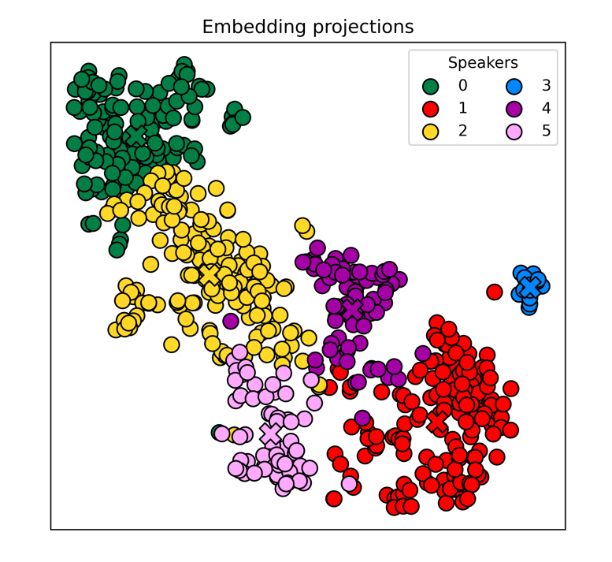

# ColorSplitter



[中文文档](README_CN.md)

[webui](https://github.com/KakaruHayate/ColorSplitter/tree/main/viewer)

A command-line tool for separating vocal timbres

# Introduction

ColorSplitter is a command-line tool for classifying the vocal timbre styles of single-speaker data in the pre-processing stage of vocal data.

For scenarios that do not require style classification, using this tool to filter data can also reduce the problem of unstable timbre performance of the model.

**Please note** that this project is based on Speaker Verification technology, and it is not clear whether the timbre changes of singing are completely related to the voiceprint differences, just for fun :)

The research in this field is still scarce, hoping to inspire more ideas.

Thanks to the community user: 洛泠羽

# New version features

Implemented automatic optimization of clustering results, no longer need users to judge the optimal clustering results themselves.

`splitter.py` deleted the `--nmax` parameter, added `--nmin` (minimum number of timbre types, invalid when cluster parameter is 2) `--cluster` (clustering method, 1:SpectralCluster, 2:UmapHdbscan), `--mer_cosine` to merge clusters that are too similar.

**New version tips**

1. Run `splitter.py` directly with the default parameters by specifying the speaker.

2. If the result has only one cluster, observe the distribution map, set `--nmin` to the number you think is reasonable, and run `splitter.py` again.

3. The optimal value of `--nmin` may be smaller than expected in actual tests.

4. The new clustering algorithm is faster, it is recommended to try multiple times.

5. The emotion classification function has now been implemented and can be called through the `--encoder emotion` function. Go to when using https://huggingface.co/audeering/wav2vec2-large-robust-12-ft-emotion-msp-dim/tree/main Download `pytorch_Model.bin` is placed in the `wav2vec2-large-robust-12-ft-emotion-msp-dim` directory.

6. You can also use `--encoder mix` to filter audio that matches two similar features at the same time. This feature can help you filter `GPT SoVITS` or `Bert-VITS2.3` prompts. 

# Progress

- [x] **Correctly trained weights**
- [x] Clustering algorithm optimization
- [ ] SSL(Waiting for the wespeaker work done)
- [x] emotional encoder
- [x] embed mix

# Environment Configuration

It works normally under `python3.8`, please go to install [Microsoft C++ Build Tools](https://visualstudio.microsoft.com/visual-cpp-build-tools/)

Then use the following command to install environment dependencies

```
pip install -r requirements.txt
```

Tips: If you are only using the timbre encoder, you only need to install the CPU version of pytorch. In other cases, it is recommended to use the GPU version. 

# How to Use

**1. Move your well-made Diffsinger dataset to the `.\input` folder and run the following command**

```
python splitter.py --spk <speaker_name> --nmin <'N'_min_num>
```

Enter the speaker name after `--spk`, and enter the minimum number of timbre types after `--nmin` (minimum 1, maximum 14，default 1)

Tips: This project does not need to read the annotation file (transcriptions.csv) of the Diffsinger dataset, so as long as the file structure is as shown below, it can work normally
```
    - input
        - <speaker_name>
            - raw
                - wavs
                    - audio1.wav
                    - audio2.wav
                    - ...
```
The wav files are best already split

**2. (Optional) Exclude outliers as shown in the figure below**


As shown, cluster 3 is obviously a minority outlier, you can use the following command to separate it from the dataset
```
python kick.py --spk <speaker_name> --clust <clust_num>
```
The separated data will be saved in `.\input\<speaker_name>_<n_num>_<clust_num>`

Please note that running this step may not necessarily optimize the results

**3. After you select the optimal result you think, run the following command to classify the wav files in the dataset
```
python move_files.py --spk <speaker_name>
```
The classified results will be saved in `.\output\<speaker_name>\<clust_num>`
After that, you still need to manually merge the too small clusters to meet the training requirements


**4. (Optional) Move `clean_csv.py` to the same level as `transcriptions.csv` and run it, you can delete the wav file entries that are not included in the `wavs` folder**


# Based on Project

[Resemblyzer](https://github.com/resemble-ai/Resemblyzer/)

[3D-Speaker](https://github.com/alibaba-damo-academy/3D-Speaker/)

[wav2vec2-large-robust-12-ft-emotion-msp-dim](https://huggingface.co/audeering/wav2vec2-large-robust-12-ft-emotion-msp-dim)

[GTSinger](https://github.com/AaronZ345/GTSinger)
