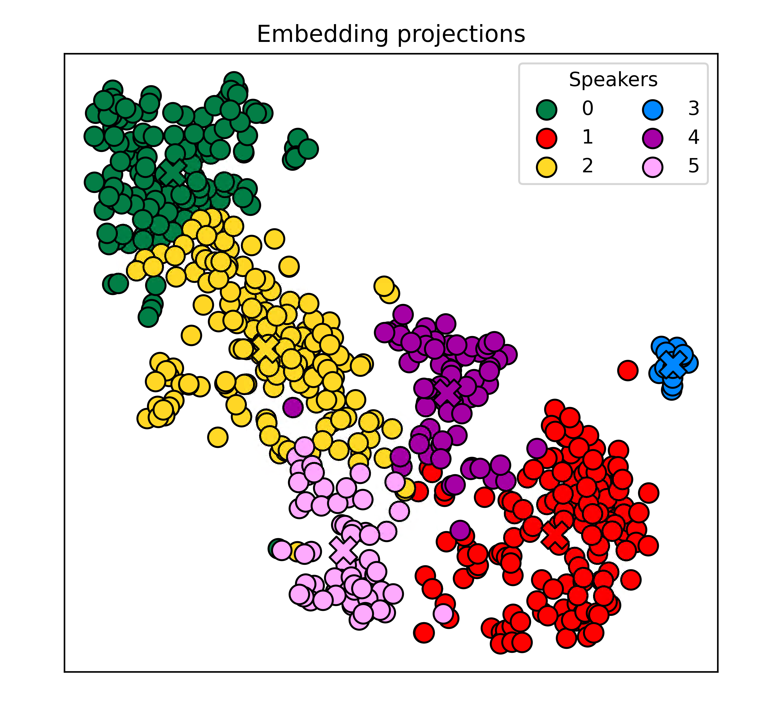
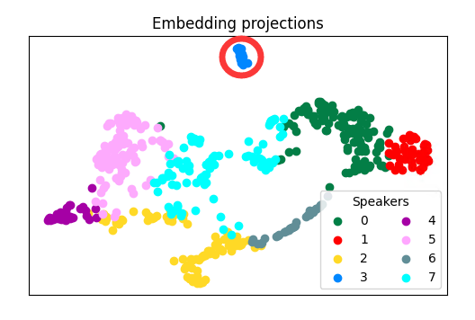

# ColorSplitter



[webui](https://github.com/KakaruHayate/ColorSplitter/tree/main/viewer)

一个用于分离歌声音色的命令行工具

# 介绍

ColorSplitter是一个为了在歌声数据的处理前期，对单说话人数据的音色风格进行分类的命令行工具

对于不需要进行风格分类的场合，使用本工具进行数据筛选，也可以减轻模型的音色表现不稳定问题

**请注意**，本项目基于说话人确认（Speaker Verification）技术，目前并不确定唱歌的音色变化是与声纹差异完全相关，just for fun：)

目前该领域研究仍然匮乏，抛砖引玉

感谢社区用户：洛泠羽

# 新版本特性

实装了聚类结果自动优化，不再需要用户自己判断聚类最优结果

`splitter.py`删除了`--nmax`参数，添加了`--nmin`（最小音色类型数量，cluster参数为2时无效）`--cluster`（聚类方式，1:SpectralCluster, 2:UmapHdbscan），`--mer_cosine`合并过于相似的簇

**新版本使用技巧**

1.默认参数直接指定说话人运行`splitter.py`

2.如果结果只有一个簇，观察分布图，将`--nmin`设为你认为合理的数量，再次运行`splitter.py`

3.实际测试下`--nmin`的最优值可能比想象的要小

4.新的聚类算法速度较快，建议多次尝试

5.新版本已支持情绪编码器的使用，可以通过`--encoder emotion`调用。使用时前往https://huggingface.co/audeering/wav2vec2-large-robust-12-ft-emotion-msp-dim/tree/main下载`pytorch_model.bin`放置在`pretrain/wav2vec2-large-robust-12-ft-emotion-msp-dim`目录下

6.你也可以用`--encoder mix`筛选同时符合两个特征相似的音频，这个功能可以帮助你筛选`GPT SoVITS`和`BertVITS2.3`的参考音频

# 进展

- [x] **正确训练的权重**
- [x] 聚类算法优化
- [ ] SSL（摆了，等we-net更新直接搬过来）
- [x] emotional encoder
- [x] embed mix

# 环境配置

`python3.8`下使用正常，请先安装[Microsoft C++ Build Tools](https://visualstudio.microsoft.com/visual-cpp-build-tools/)

之后使用以下命令安装环境依赖

```
pip install -r requirements.txt
```
注意：如果你只是用音色编码器则只需要安装CPU版本的pytorch，其他情况下建议使用GPU版本

# 如何使用

**1.将你制作好的Diffsinger数据集移动到`.\input`文件夹下，运行以下命令**

```
python splitter.py --spk <speaker_name> --nmin <'N'_min_num>
```

其中`--spk`后输入说话人名称，`--nmin`后输入最小音色类型数量（最小1最大14默认1）

tips:本项目并不需要读取Diffsinger数据集的标注文件（transcriptions.csv），所以保证只要文件结构如下所示就可以正常工作
```
    - input
        - <speaker_name>
            - raw
                - wavs
                    - audio1.wav
                    - audio2.wav
                    - ...
```
其中wav文件最好已经进行过切分

**2.（可选）剔除如下图所示的离群点**



如同所示，簇3明显为少数离群点，可以使用以下命令将其从数据集中分离
```
python kick.py --spk <speaker_name> --clust <clust_num>
```
被分离出的数据将保存在`.\input\<speaker_name>_<clust_num>`

请注意运行此步骤未必会对结果产生正向优化

**3.选定你认为的最优结果后，运行以下命令将数据集中的wav文件分类
```
python move_files.py --spk <speaker_name>
```
分类后结果将保存到`.\output\<speaker_name>\<clust_num>`中
在那之后还需要人工对过小的簇进行归并，以达到训练的需求

**4.（可选）将`clean_csv.py`移动到与`transcriptions.csv`同级后运行，可以删除`wavs`文件夹中没有包含的wav文件条目**

# 基于项目

[Resemblyzer](https://github.com/resemble-ai/Resemblyzer/)

[3D-Speaker](https://github.com/alibaba-damo-academy/3D-Speaker/)

[wav2vec2-large-robust-12-ft-emotion-msp-dim](https://huggingface.co/audeering/wav2vec2-large-robust-12-ft-emotion-msp-dim)
