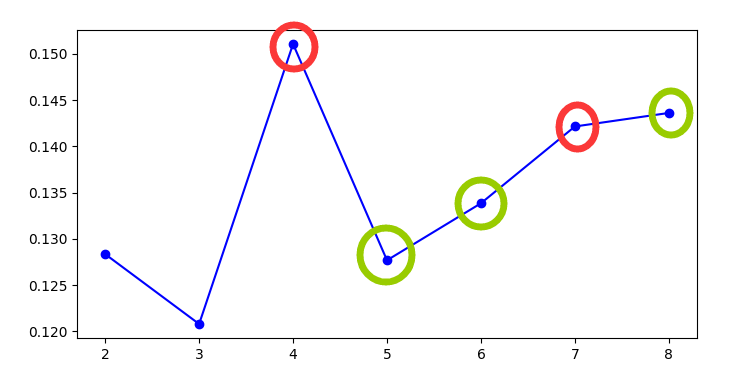

# ColorSplitter

一个用于分离歌声音色的命令行工具

# 介绍

ColorSplitter是一个为了在歌声数据的处理前期，对单说话人数据的音色风格进行分类的命令行工具

**请注意**，本项目基于声纹识别（speaker identification）技术，目前并不确定唱歌的音色变化是与声纹差异完全相关，just for fun：)

目前该领域研究仍然匮乏，抛砖引玉

感谢社区用户：洛泠羽

# 环境配置

`python3.8`下使用正常，请先前往[安装pytorch](https://pytorch.org/)（本项目CPU/GPU下均可运行）以及[Microsoft C++ Build Tools](https://visualstudio.microsoft.com/visual-cpp-build-tools/)

之后使用以下命令安装环境依赖

```
pip install -r requirements.txt
```

# 如何使用

**1.将你制作好的Diffsinger数据集移动到`.\input`文件夹下，运行以下命令**

```
python splitter.py --spk <speaker_name> --nmax <'N'_max_num>
```

其中`--spk`后输入说话人名称，`--nmax`后输入最大音色类型数量（最小2最大14）

tips:本项目并不需要读取Diffsinger数据集的标注文件（transcriptions.csv），所以保证只要文件结构如下所示就可以正常工作
```
    - input
        - <speaker_name>
            - raw
                - wavs
                    - audio1.wav
                    - audio2.wav
                    - ...
```
其中wav文件最好已经进行过切分

**2.（可选）剔除如下图所示的离群点**


如同所示，簇3明显为少数离群点，可以使用以下命令将其从数据集中分离
```
python kick.py --spk <speaker_name> --n <n_num> --clust <clust_num>
```
被分离出的数据将保存在`.\input\<speaker_name>_<n_num>_<clust_num>`

请注意运行此步骤未必会对结果产生正向优化

**3.通过轮廓分数寻找最优结果，轮廓分数越高则结果越好，但最优结果不一定在最高分处，可能在邻近的结果上**



选定你认为的最优结果后，运行以下命令将数据集中的wav文件分类
```
python move_files.py --spk <speaker_name> --n <n_num>
```
分类后结果将保存到`.\output\<speaker_name>\<clust_num>`中
在那之后还需要人工对过小的簇进行归并，以达到训练的需求

**4.（可选）将`clean_csv.py`移动到与`transcriptions.csv`同级后运行，可以删除`wavs`文件夹中没有包含的wav文件条目**

# 基于项目

[Resemblyzer](https://github.com/resemble-ai/Resemblyzer/)
