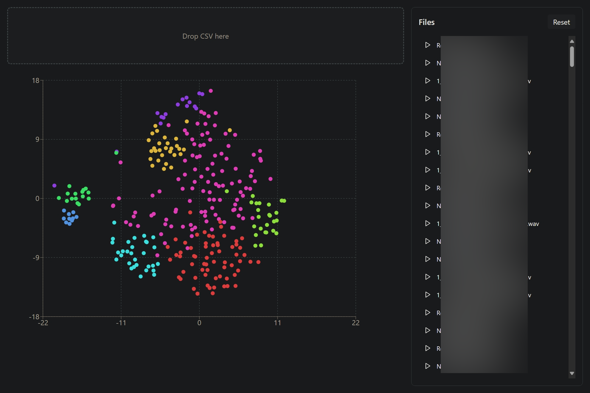

# Cluster viewer

After running Colour Splitter you would get a csv file. You can use this viewer to load this csv file, listen to each point in the scatter plot and interactively explore the cluster result.

## Prerequisites

- Bun (faster) or npm
- Modern web browser

## Build

1. Navigate to the viewer directory:

```bash
cd viewer
```

2. Install dependencies:

```bash
# Using Bun
bun install

# Or using npm
npm install
```

## Serve

You'll need to run two servers simultaneously *in viewer directory*:

1. Web Application Server

```bash
# Using Bun
bun run dev

# Or using npm
npm run dev
```

2. Audio file server

```bash
# Using Bun
bunx http-server --cors -p 8080

# Or using npm
npx http-server --cors -p 8080
```

## Usage



1. Open your browser and navigate to the URL shown by the web application server (typically something like http://localhost:5173)
2. Look for the tab titled "Vite + React + TS"
3. Drag and drop your CSV file (generated by the color splitter) into the designated dropping area
4. Explore your clusters and play audio samples by clicking on individual data points
